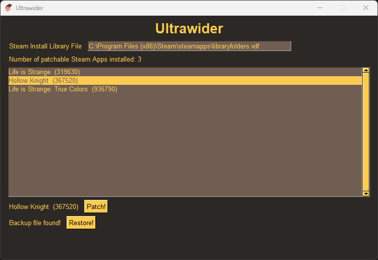

# Ultrawider
 An auto patcher for select games to be enjoyed in other aspect ratios
 

MFW a game doesn't have native ultrawide support

# GUI

How it works:

- To patch in another aspect ratio, we must change the hex patterns at certain offsets for a game's files
- We do this with hexalter.c which takes offset locations (ie. 0x3f) for an input file (ie. game.exe) and overrides the offset with the patch (ie 0x18), patching in the aspect ratio
- Steam keeps a manifest of all isntalled games. This program reads the manifest library folder and each individual manifest to determine where all games installed
- Before patching the files, we make a backup under ./backups/{apppID}/{patched_file}
- Then the program patches the files at the game's install location
- The restore button shows up once the backup is made, allowing for easy undoing of the patch

# Supported Games
Game Name (Steam App ID)
 *App ID's can be found in the url of a game's Steam store page*
  *Hollow Knight: https://store.steampowered.com/app/367520/Hollow_Knight/*
- Hollow Knight (367520)
- Horizon Zero Dawn (1151640)
- Life is Strange (319630)
- Life is Strange: True Colors (936790)
- Death Stranding (1190460)

# Install
- Download latest release: https://github.com/gdiazbanuelos/ultrawider/releases
- Windows file: `ultrawider.exe`
- Linux file: `ultrawider`

# Future updates
- Patch FOV values
- Added ability to patch other aspect ratios (32:9, 16:10)
- Highlight already patched games in green
- Add optional JSON file to final build so that anyone can manually add games to patcher tool

# Building Ultrawider
- Install Python
- Install Pip3 packages: `pip3 install vdf pysimplegui pyinstaller`
- Or run `pip3 install -r ./dep/requirements.txt`
  
- To build on Windows: `python -m PyInstaller .\ultrawider.py --clean -F --add-data="games.json;." --add-data="hexalter.exe;." `
- To build on Linux: `pyinstaller ultrawider.py --clean -F --add-data "games.json:." --add-data "hexalter:."`
- Or on Windows: `.\build.ps1`
- Or on Linux: `./build.sh`
- Alternatively only build `ultrawider' on your platform without the `-add-data` commands, then place `games.json` and/or `hexalter.exe` or 'hexalter' (depending on platform, or use .exe with Wine on Linux) in the `./dest` folder
  
If you want to build `hexalter.exe` yourself, run `gcc -o hexalter.exe hexalter.c` or `gcc -o hexalter.exe hexalter.c`
